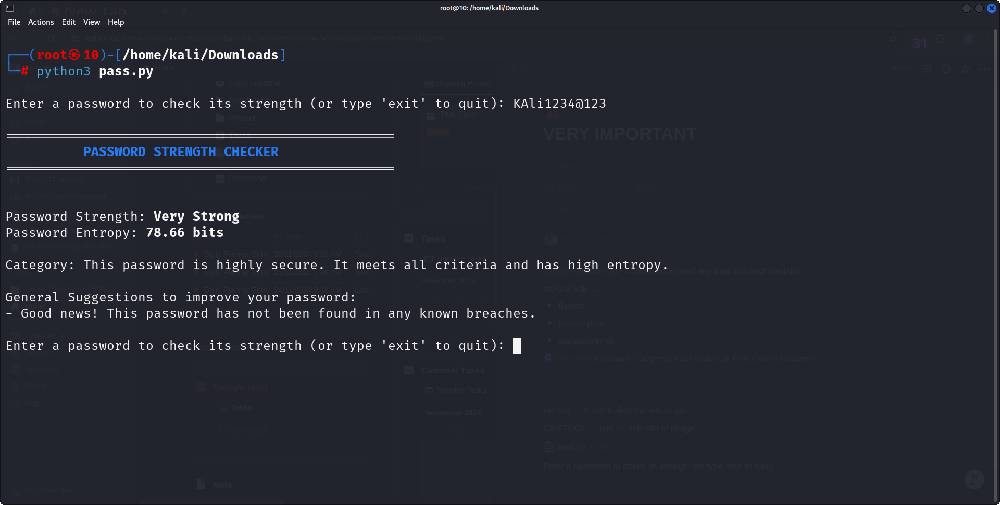

<div align="center">
    <h1 style="font-weight: bold; color: blue;">Password Strength Checker </h1>
</div>


<p align="center">
  <a href="#introduction">Introduction</a> •
  <a href="#features">Features</a> •
  <a href="#installation">Install</a> •
  <a href="#usage">Usage</a>
</p>


## Introduction

The Tic-Tac-Toe game is a simple yet engaging implementation of the classic two-player strategy game. This project provides an interactive console-based version of the game with options for single-player (against a computer) or two-player modes. The game includes enhanced features such as colored player symbols (X and O), a replay option, and a user-friendly grid system for move selection.

The goal of this project is to demonstrate core programming concepts such as:

- Control structures (loops, conditionals)
- Array manipulation
- User input handling
- Basic AI for single-player mode


---

## Features

<h1 align="left">
  </a>
  <br>
</h1>


- **Password Length Check**: Ensures the password is of adequate length (at least 12 characters).
- **Character Variety**: Checks for a mix of uppercase letters, lowercase letters, digits, and special characters.
- **Entropy Calculation**: Calculates password entropy to measure its randomness and complexity.
- **Common Password Check**: Alerts users if their password is among commonly used passwords.
- **Breach Check**: Checks if the password has been exposed in data breaches via the HaveIBeenPwned API.
- **Enhanced Feedback**: Provides detailed suggestions for improving weak passwords.
- **Auto Save Weak Passwords**: Tracks and saves weak or moderate passwords to a common passwords file for monitoring.

---

### Usage 

```bash
cd password-strength-checker
python password_strength_checker.py
```
This will Display  Enter a password to check its strength (or type 'exit' to quit): 

    ==================================================
         PASSWORD STRENGTH CHECKER
    ==================================================
    Password Strength: Very Strong
    Password Entropy: 78.66 bits

    Category: This password is highly secure. It meets all criteria and has high entropy.

    General Suggestions to improve your password:

      - Good news! This password has not been found in any known breaches.

    Enter a password to check its strength (or type 'exit' to quit):

 
---
## Installation

### Prerequisites
To use this password checker, you will need:
- Python 3.x (Python 3.6 or above recommended)
- Access to the internet for breach checking (uses HaveIBeenPwned API)

### Step of Installing from Repositry 
```bash
git clone https://github.com/tarunkumar910/password_strength_checker.git
cd password-strength-checker
pip install -r requirements.txt
python password_strength_checker.py
```
